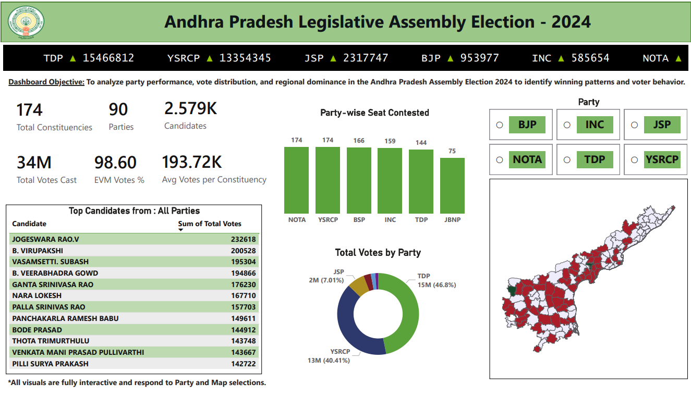

# 🗳️ Andhra Pradesh Assembly Election Analysis 2024

## 📌 Overview

This Power BI dashboard analyzes the Andhra Pradesh Legislative Assembly Election 2024, providing insights into party performance, vote distribution, candidate rankings, constituency-level trends, and regional electoral dominance.

The dashboard transforms election data into interactive visualizations that support deeper understanding of voting behavior and electoral outcomes across Andhra Pradesh.

---

## 📊 Dashboard Preview

---

## 🎯 Project Objective

The Andhra Pradesh Assembly Election 2024 involved multiple political parties, thousands of candidates, and millions of voters across 174 constituencies.

This dashboard was developed to answer key analytical questions:

- Which parties received the highest number of votes?
- How many constituencies were contested by each party?
- Which candidates secured the highest vote counts?
- How did vote distribution vary across regions?
- Which parties demonstrated the strongest constituency-level presence?

---

## 📈 Key Metrics

| Metric | Value |
|----------|----------|
| Total Constituencies | 174 |
| Political Parties | 90 |
| Candidates | 2.58K |
| Total Votes Cast | 34M |
| EVM Votes Percentage | 98.60% |
| Average Votes per Constituency | 193.72K |

---

## 🔍 Key Insights

### 🏛 Party Performance

- TDP secured the highest vote share among major parties.
- YSRCP emerged as the second-largest contributor in total votes.
- JSP, BJP, INC, and other parties contributed smaller shares of the overall vote distribution.

### 🗳 Constituency Analysis

- Election results were analyzed across all 174 constituencies.
- Constituency-level performance revealed variations in party dominance across regions.

### 👥 Candidate Performance

- Candidate rankings identified the highest vote-getters across the state.
- Performance comparisons enabled analysis of candidate popularity and electoral strength.

### 📊 Party Participation

- Party-wise seat contest analysis highlighted participation levels among major and minor parties.
- Several parties contested across a large number of constituencies, indicating statewide presence.

### 🗺 Regional Trends

- Geographic visualizations highlighted constituency-wise electoral patterns.
- Regional differences in voting behavior were observable through map-based analysis.

---

## 📊 Dashboard Features

- Interactive Party Filters
- Constituency-Level Analysis
- Candidate Performance Rankings
- Party-wise Vote Distribution
- Seats Contested Analysis
- Geographic Election Mapping
- Dynamic KPI Cards
- Interactive Data Exploration

---

## 🛠 Tools & Technologies

- Power BI
- DAX
- Power Query
- Data Modeling
- Geo-Spatial Visualization

---

## 💡 Applications

This dashboard can be useful for:

- Political Analysts
- Journalists
- Researchers
- Students
- Election Enthusiasts
- Data Analysts

to explore and understand election trends through interactive data visualizations.

---

## 📂 Repository Contents

| File | Description |
|--------|-------------|
| Andhra-Pradesh-Election-2024-Dashboard.pbix | Power BI dashboard |
| Andhra-Pradesh-Election-2024-Dataset.xlsx | Election dataset |
| dashboard-overview.png | Dashboard preview image |

---

### Author

**Medhavi Agrawal**  
Aspiring Data Analyst | Power BI | SQL | Excel
